# Unmet need and covariates (Honduras)

**Survey:** Honduras DHS 2011–12; Honduras MICS 2019.

**Analytic sample:** Women in adolescent or young-adult age groups with non-missing unmet need, 
using survey weights (cluster/strata design). *Unmet need* is binary (yes = spacing or limiting need).

## Visualization choices

- **Outcome on the vertical axis:** weighted **prevalence of unmet need** (proportion × 100), 
so you can compare levels of need across covariate categories.
- **Error bars:** approximate **95% confidence intervals** from the survey design (uncertainty matters).
- **Horizontal bars:** easier to read long category labels (Cleveland / small-multiples friendly).
- **Single hue:** reduces chart junk; emphasis stays on *magnitude and uncertainty*, not decoration.

---

## 1. Education

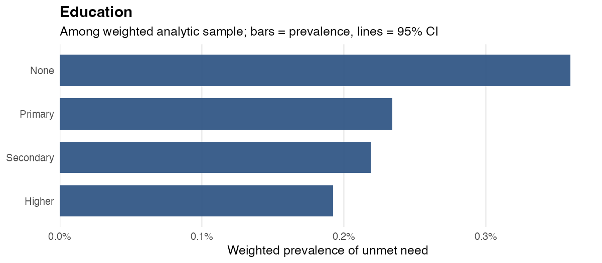

## 2. Married or in union

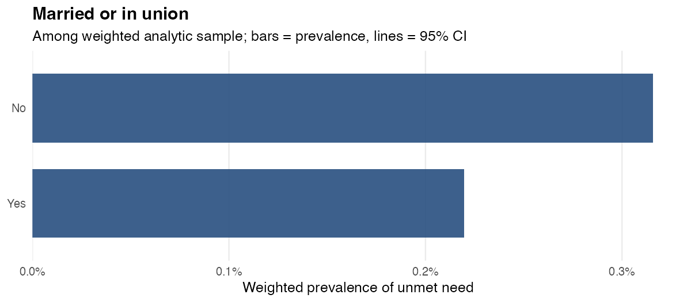

## 3. Place of residence

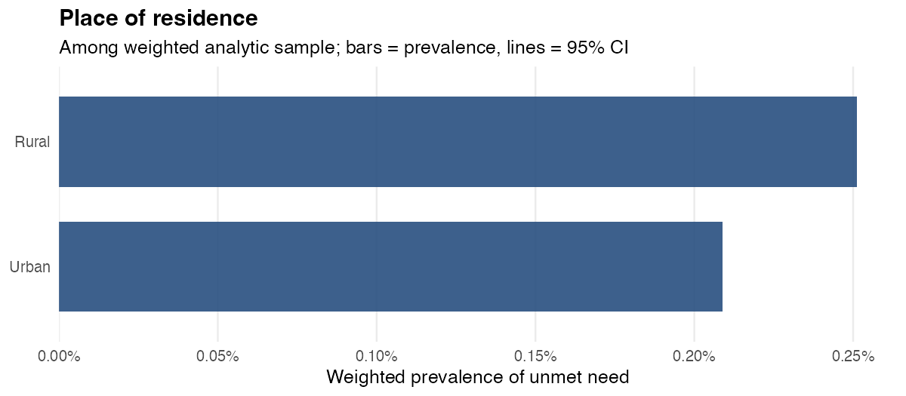

## 4. Wealth (tertile)

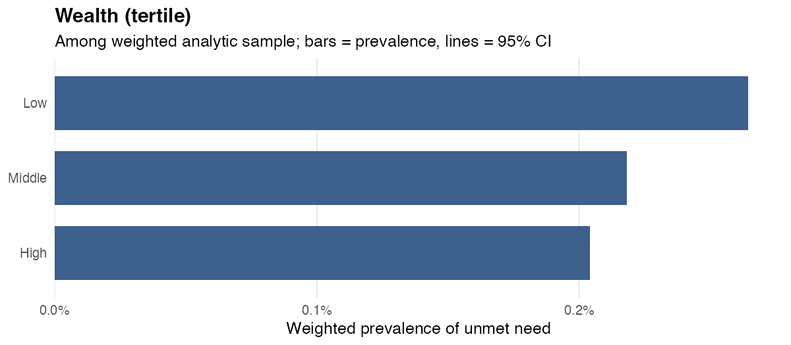

## 5. Currently pregnant

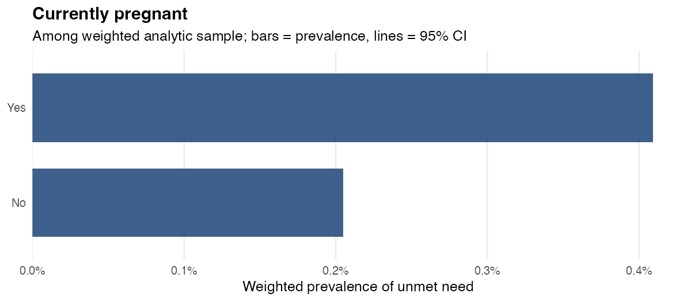

## 6. Sexually active or in union (eligibility-related)

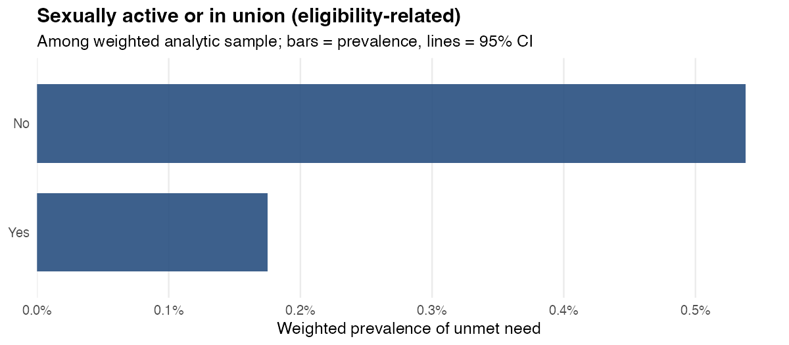

## 7. Using modern contraception

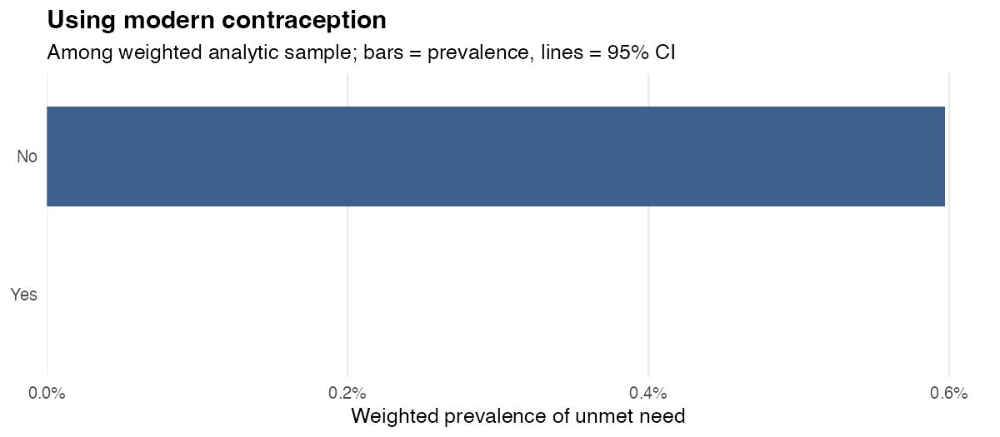

## 8. Currently working

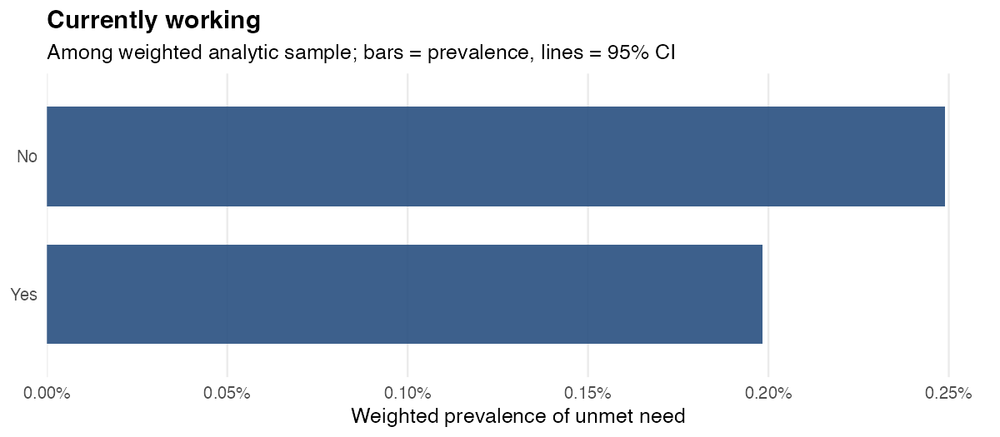

## 9. Age group (adolescent vs young adult)

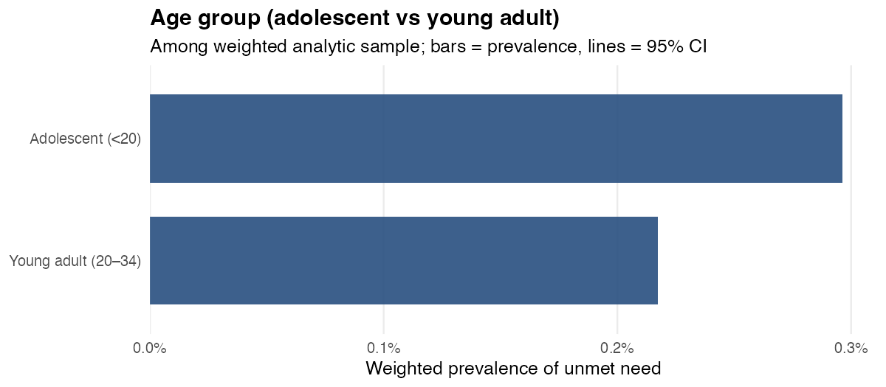

## 10. Region

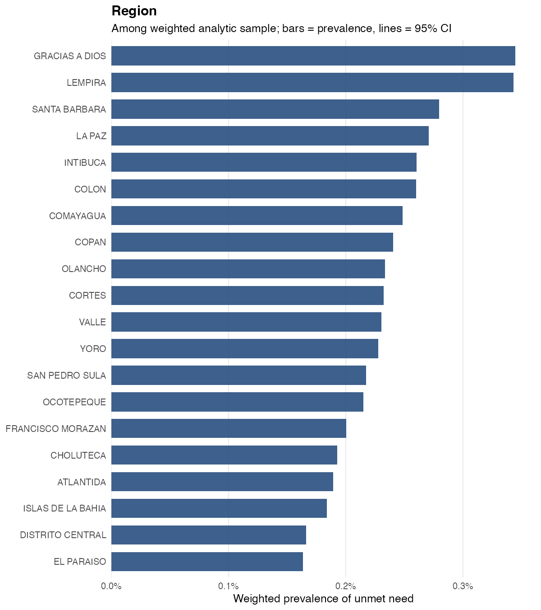

## 11. Parity

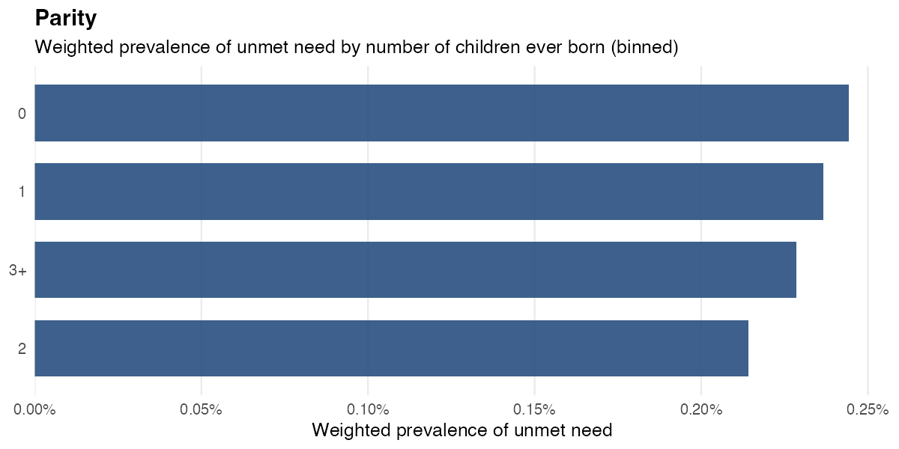

---

*Report generated by `scripts/04_reporting/unmet_need_covariate_plots_honduras.R`.*
